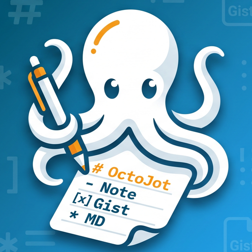

<div align="center">



# Octo Jotter

**An offline-first Markdown notes app for Android that syncs to your GitHub Gists.**

</div>

---

Octo Jotter keeps your notes on-device and in sync with private GitHub Gists, so
your writing is versioned, portable, and never locked into a proprietary cloud.
Write in Markdown, preview instantly, and pick up on any machine that can read a
Gist.

## Features

- 📝 **Markdown editor** with a formatting toolbar (bold, italic, strikethrough,
  lists, links) and live preview.
- 🐙 **GitHub Gist sync** — each note is a **private** Gist, synced in the
  background. Your data stays in your own GitHub account.
- 📴 **Offline-first** — notes live in a local Room database and sync when a
  network is available.
- 🗂️ **Folders & tags** for organising notes, plus **pin**, **search**, and
  swipe-to-delete.
- 💾 **Auto-saved drafts** so nothing is lost mid-edit.
- 🌗 **Light / dark / system** theming, plus **community theme/snippet/script
  plugins** (see [Community plugins](#community-plugins)).
- 🔒 **Encrypted token storage** — your GitHub Personal Access Token is stored
  with `androidx.security.crypto`, never in plain text.
- ✨ **AI assistance** powered by Gemini (via Firebase AI) — optional, requires
  Firebase configuration (see below).

## Tech stack

| Area | Choice |
|------|--------|
| Language | Kotlin |
| UI | Jetpack Compose + Material 3, Navigation Compose |
| Local storage | Room, DataStore Preferences |
| Background work | WorkManager |
| Networking | Retrofit + Moshi + OkHttp (GitHub Gists API) |
| AI | Firebase AI (Gemini) + App Check |
| Build | AGP 9.1.1, Gradle 9.6.1, KSP |

**Min SDK 24 (Android 7.0) · Target/Compile SDK 36 · `applicationId` `com.l3ad3r1.octojotter`**

## Getting started

### Prerequisites

- Android Studio (latest) or the Android command-line SDK, with **SDK Platform 36**.
- **JDK 17+** (Android Studio's bundled JBR 21 works out of the box).

### 1. Clone

```bash
git clone https://github.com/l3ad3r1/Octo-Jotter.git
cd Octo-Jotter
```

### 2. Configure secrets

Secrets are read from a `.env` file via the Secrets Gradle Plugin (falling back to
`.env.example`). Copy the example and fill in your key:

```bash
cp .env.example .env
```

```properties
# .env
GEMINI_API_KEY=your_key_here
```

> The AI features additionally require **Firebase**. Add your own
> `google-services.json` to `app/`. Without it the build still succeeds
> (`google-services` is set to `WARN`), but AI/App Check calls won't function.

### 3. Run

```bash
./gradlew installDebug      # build + install a debug build on a connected device
# or open the project in Android Studio and press Run
```

On first launch, open **Settings → GitHub** and paste a **Personal Access Token**
with the `gist` scope to enable sync. Create one at
<https://github.com/settings/tokens>.

## Building a release APK

The release build type is signed with an upload keystore supplied via environment
variables (never commit your keystore):

```bash
export KEYSTORE_PATH=/absolute/path/to/my-upload-key.jks
export STORE_PASSWORD=********
export KEY_PASSWORD=********
./gradlew assembleRelease
```

The signed APK is written to `app/build/outputs/apk/release/app-release.apk`.

To generate an upload keystore:

```bash
keytool -genkeypair -v -keystore my-upload-key.jks -keyalg RSA -keysize 2048 \
  -validity 10000 -alias upload
```

## Community plugins

Octo Jotter can be extended with lightweight, JSON-based plugins — **themes**,
editor **snippets**, and sandboxed **script** commands. Plugins are hosted in this
repo under [`plugins/`](plugins/) and installed in-app from **Settings → Community
Plugins** (no app rebuild required — the registry is fetched live).

- 📖 **Authoring guide:** [`plugins/README.md`](plugins/README.md) — full manifest
  schema, the theme color slots, the sandboxed `octo` script API, and a
  test/submit checklist.
- 🧩 **Starter template:** copy [`plugins/_template/`](plugins/_template/) for a
  ready-made `theme` / `snippet` / `script` manifest to fill in.
- 🤝 **Submitting one:** see [`CONTRIBUTING.md`](CONTRIBUTING.md) for the plugin PR
  checklist and review criteria.

### Use it as a Second Brain

With repository sync + the **Second Brain Templates** and **Second Brain Tools**
plugins, Octo Jotter becomes a Git-backed knowledge vault (daily notes, projects,
learnings, tasks). See the [Second Brain guide](docs/SECOND-BRAIN.md) for the
vault structure and how it maps to a typical Obsidian setup.

## Project structure

```
app/src/main/java/com/l3ad3r1/octojotter/
├── MainActivity.kt          # single-Activity host, installs the splash screen
├── ui/                      # Compose screens, NoteApp, NoteViewModel, theme
├── data/
│   ├── local/               # Room entities, DAO, DataStore prefs, backup
│   ├── remote/              # GitHub Gists API (Retrofit), encrypted TokenManager
│   └── repository/          # NoteRepository — local <-> Gist reconciliation
└── sync/                    # SyncWorker (WorkManager)
```

## License

No license has been specified yet. Until one is added, all rights are reserved by
the author.
